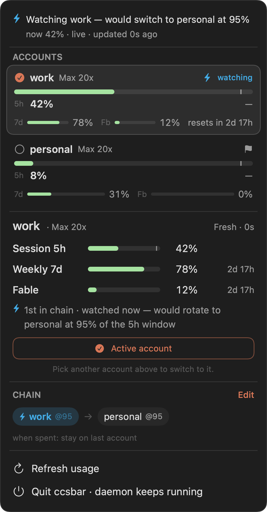
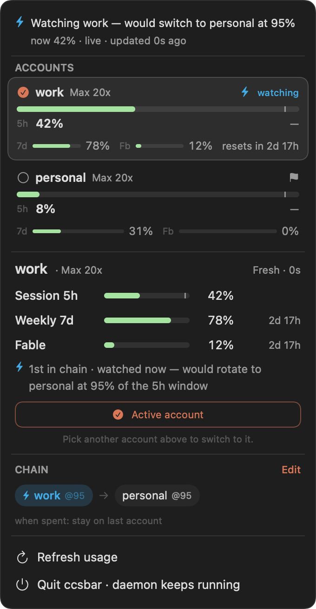
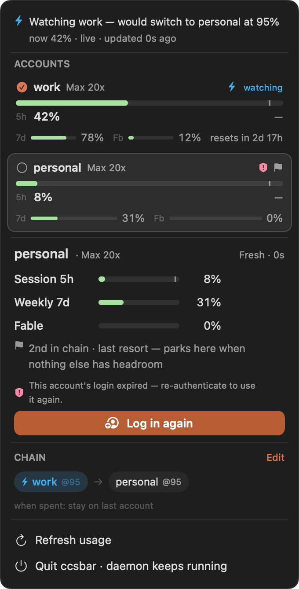
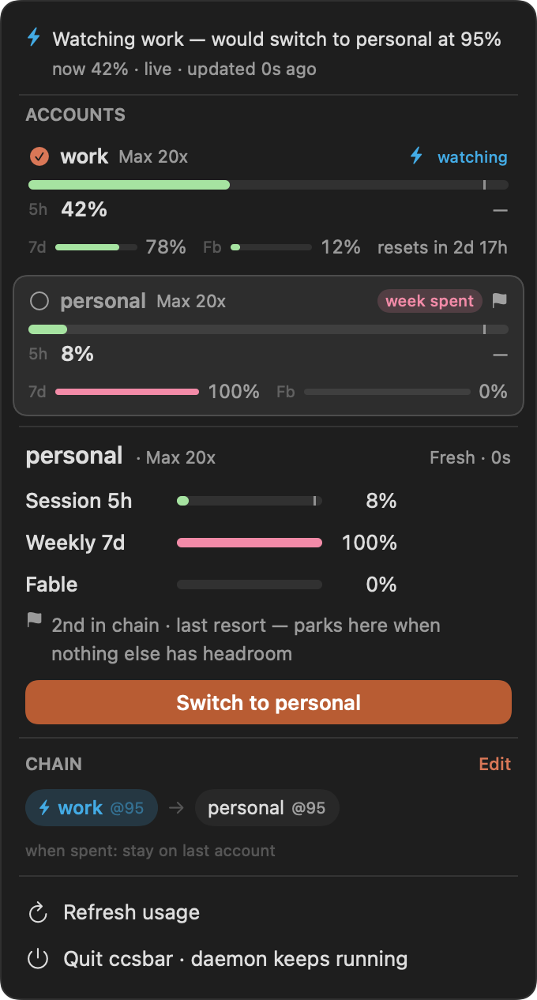

# ccsbar — Claude Code Switcher Bar

A native macOS menu-bar companion for [clauth](https://github.com/xingfanxia/clauth)
— glance at every Claude Code account's 5-hour usage, see what auto-switch will do
next, and switch deliberately when you want to, without opening the TUI.

The panel is **inspect-first** ("Preflight"): a single click on any account
**inspects** it (pure view state, zero daemon traffic) — browse freely — while
switching is a distinct verb in the detail card, guarded so a Keychain rewrite
can't silently strand a live Claude session.

ccsbar is a thin UI over clauth's daemon: it reads `~/.clauth/status.json`
(written every tick by `clauth daemon`) for display and drives
`~/.clauth/clauthd.sock` (with a `clauth <name>` shell fallback) to switch. It
owns no credentials and runs no network of its own.

<p align="center">
  
</p>

The panel, top to bottom: the **forecast strip** ("Watching work — would switch
to personal at 95%"), the **account list** with live 5h / 7d / Fable bars, the
**detail card** for the inspected account, and the **chain rail** showing the
ordered fallback. Three states it has a loud, fixed home for:

| Healthy | Login dropped | Window spent |
|---|---|---|
|  |  |  |

### What ccsbar is a window into

The whole point is what `clauth daemon` does underneath: when the active
account's 5-hour window fills, it rewrites **one macOS Keychain item** and the
next request from your running `claude` session quietly authenticates as the
next account — no restart, no re-login.

<p align="center">
  
</p>

<p align="center">
  
</p>

ccsbar exists to make that invisible move **visible and deliberate** — it
forecasts the next switch before it fires, flashes "⇄ rotated to X" when it does,
and lets you switch by hand when you want to. The full story:
[I Taught My Claude Accounts to Rotate Themselves](https://blog.ax0x.ai/hot-swapping-claude-logins).

## Requirements

- macOS 14+ (Sonoma), Swift 6 toolchain (Xcode 16+).
- `clauth` installed and the daemon running:
  ```sh
  # from the clauth repo
  dist/macos/daemon-install.sh      # LaunchAgent (runs at login), or:
  clauth daemon                     # foreground, for a quick try
  ```
  ccsbar reads the daemon's liveness distinctly: if the daemon was never
  started (no `status.json`), the menu shows **"clauth daemon not running"**; if
  it wrote the file and then died, the panel keeps the last data under a loud
  **"Daemon stalled — data from HH:MM"** banner (so a frozen % never reads as
  current) and the menu-bar glyph dims; if the daemon's `status.json` schema is
  newer than this build understands, it shows **"ccsbar out of date"** rather
  than a misleading "not running".

## Run (development)

```sh
swift run          # launches as a menu-bar accessory (no Dock icon)
```

The menu-bar title shows the **active account name + 5h %** (so the active
account is unmistakable at a glance), with all other state encoded in the SF Symbol
shape — a near-threshold dot, a switch-in-flight ellipsis, a rotation glyph, a
`bolt.slash` when auto-switch is disarmed, or a warning triangle + frozen age when
the daemon dies (the % is withheld rather than shown stale). Clicking it opens a
translucent SwiftUI panel (`MenuBarExtra(.window)`, matching CodexBar's look), laid
out top to bottom as **status strip → account list → detail card → chain rail →
actions**:

- a **status strip** — the single place exceptional truth appears, priority-ordered:
  a dead-daemon banner (with a one-click **Start daemon**) > the switch lifecycle
  (arm / switching… / switched / failed) > a wrap-off "all off, resumes when a
  window resets" card > a zero-armed "auto-switch is idle" warning > otherwise the
  **forecast sentence** ("Watching work — would switch to personal at 95% · now 62%"),
  the daemon's own published chain-walk forecast.
- the **account list** — one row per account in **file order (rows never reorder)**;
  single click **inspects**. Each row leads with a full-width 5h bar carrying a tick
  at that account's own auto-switch threshold, then half-width 7d / Fable bars, plus
  badges (a sapphire "⚡ watching" chip when armed, a danger "spent"/"week spent"/"5h
  spent" pill with a muted name when a window is at its cap, a last-resort flag,
  in-use, login-expired). Third-party api-key accounts show an availability dot instead
  of %-bars.
- the **detail card** for the inspected account — its three windows with reset times,
  a forecast-driven chain-membership line, and **the one switch surface**: a static
  "Active account" for the current one, a **"Log in again"** browser-reauth verb for an
  account whose OAuth login dropped (see below), or a **Switch** verb. If the active
  account has a live Claude session, the first click **arms** ("Confirm — live session
  on …") and a second within 5s fires; with the daemon down it becomes "Switch via
  CLI", confirmed by exit code.
- the **chain rail** — the ordered fallback chain as chips joined by arrows, the armed
  member glowing in sapphire, plus the "when spent" outcome. **Edit** opens the
  inline Configure disclosure.
- **actions** — Refresh usage, Start at login, Quit (the daemon keeps running).

**Two config surfaces, no Settings window:** a native **right-click context menu** on
every row (switch / refresh / re-authenticate / rename / add–remove / move / "Leave
chain at ▸" preset submenu / last-resort toggle / copy name) for fast edits, and the inline **Configure**
disclosure as the canonical editor (per-account threshold, last-resort flag, reorder, add/remove, and the
wrap-off
setting as a plain-language radio). Removing an armed member asks first. Both drive the
daemon's control socket (`clauthd.sock`), so a running `clauth daemon` is required to
edit (display works off `status.json` alone).

**Dropped-login recovery (AUTH-3):** OAuth logins sometimes drop silently. The daemon
flags such an account `auth_broken` in `status.json` the moment a token refresh fails
with a dead refresh token, and ccsbar surfaces it — a **login-expired** badge on the
row and, in the detail card, a **"Log in again"** verb that spawns `clauth login <name>`
(a self-contained browser OAuth sign-in that mints fresh tokens and clears the flag). It
runs the same whether the daemon is up or down, so a dropped login is recoverable without
leaving the panel; a top-of-panel banner shows the sign-in is in flight ("finish in your
browser"). The context menu also offers **Re-authenticate (browser)** for any OAuth
account proactively, not only a broken one. Third-party api-key accounts have no login to
renew, so the reauth affordances are hidden for them.

## Build a real app

```sh
Scripts/package_app.sh        # → build/ccsbar.app (LSUIElement, ad-hoc signed)
open build/ccsbar.app      # run it, or:
cp -R build/ccsbar.app /Applications/   # install it
```

**Autostart:** on first launch the app registers itself as a login item via
`SMAppService`, so the panel comes back after a reboot (the daemon already does,
via its LaunchAgent). Toggle it off any time with **Start at login** in the panel
— no manual System Settings step. A single-instance guard means launching a
second copy just bows out, and the running one keeps its single menu-bar item.

## Status

Implemented (the CBAR-4 "Preflight" redesign):

- **SwiftUI `MenuBarExtra(.window)`** translucent panel (matching CodexBar),
  light/dark aware — replaces the earlier `NSMenu` + block-character (█░) bars.
- **Menu-bar label ladder** — active account **name + 5h %**, with all other state
  in the SF Symbol shape (never color, which the menu bar flattens): near-threshold
  dot, switch-in-flight ellipsis, rotation glyph, `bolt.slash` when disarmed, and a
  warning triangle + frozen age (% withheld) when the daemon dies.
- **Inspect-first account list** — file-order rows (never reorder); single click
  inspects (zero daemon traffic). 5h-dominant row anatomy: full-width 5h bar with an
  in-track threshold tick, half-width 7d / Fable bars, and badges ("⚡ watching" when
  armed / "spent" pill + muted name when a window is capped / last-resort flag / in-use /
  login-expired). Third-party accounts show an availability dot.
- **Detail card + one switch verb** — the inspected account's three windows, a
  forecast-driven chain line, and a deliberate Switch with the **live-session
  arm-confirm** guard and a **CLI fallback** (confirmed by exit code) when the daemon
  is down.
- **Dropped-login recovery (AUTH-3)** — an `auth_broken` account (the daemon flags it
  when a token refresh hits a dead refresh token) gets a **"Log in again"** browser-reauth
  verb instead of a dead-end hint; it spawns `clauth login <name>` (works daemon-up or
  -down), guarded so only one sign-in runs at a time, with a global in-flight banner. The
  context menu offers proactive **Re-authenticate (browser)** for any OAuth account.
- **Truthfulness engines** (pure, unit-tested): a **forecast** that renders the
  daemon's OWN published next-move (`status.json.forecast`, clauth 81c00a2+) as the
  source of truth, with the line-pinned `fallback.rs` chain-walk **mirror** kept only
  as a fallback for older daemons (fixture-tested — never a naive position+1),
  a graded **liveness ladder** (live < 5s / syncing < 15s / dead) on the 1s write
  cadence, a **switch state machine** (arm / pending / confirmed / failed), and the
  **menu-bar label ladder** — plus a **rotation heartbeat** that flashes "rotated to
  X" when auto-switch fires unattended.
- **Two config surfaces** — a native right-click context menu on every row, and the
  inline **Configure** disclosure (per-account threshold, an independent last-resort
  flag, reorder, add/remove, and a
  plain-language wrap-off radio; armed-member removal asks first). Both drive the
  daemon's config socket, with an "Applying…" shimmer and loud revert-on-rejection.
- **Rename a profile** — the context-menu **"Rename…"** opens an inline editor (a
  TextField with live validation mirroring the daemon's name rule); a valid name drives
  the `rename` socket command, which renames the profile dir + every reference and
  re-links the credential mirror if it's the active account (so a live session follows
  the rename). An invalid/taken name surfaces a loud error and never fires the socket.
- **Distinct daemon-liveness states** — never-started (empty state) vs frozen (dead
  banner over dimmed last-known data, % withheld) vs schema-too-new (out-of-date).
- Runs as an accessory app (no Dock icon); packaged as an ad-hoc-signed `.app`.
- **`--snapshot=<variant>`** renders any canonical state to a PNG headlessly
  (`default` / `inspecting` / `mid-switch` / `daemon-dead` / `config` /
  `remove-confirm` / `spent` / `reauth`; a design-review aid, not part of the normal run).

Deferred:

- **Packaging (partial)** — `.app` bundling done (`Scripts/package_app.sh`, ad-hoc
  signed). Still deferred: Sparkle auto-update, Developer-ID signing + notarization,
  Homebrew cask.
- `Add Account…` (→ `clauth login`), chip-click-to-inspect on the chain rail.

## Architecture

| File | Role |
|---|---|
| `DaemonStatus.swift` | `Codable` mirror of `status.json` (schema 1) + window/auth accessors |
| `Exhaustion.swift` | pure `ProfileStatus.spentTag` — the one definition of "a window is at its cap" |
| `DaemonClient.swift` | read `status.json`; switch/refresh/config over the socket (shell fallback); `reauth` spawns `clauth login <name>` |
| `Theme.swift` | color roles (one meaning per hue) + `UsageBar` (threshold tick) + `usageColor`/`resetHint` |
| `ForecastEngine.swift` | pure `fallback.rs::next_target` mirror — FALLBACK "would switch to X" prediction for daemons too old to publish `status.json.forecast` |
| `LivenessLadder.swift` | graded freshness (live / syncing / dead) on the 1s write cadence |
| `SwitchMachine.swift` | pure switch-lifecycle reducer (arm / pending / confirmed / failed) |
| `MenuBarLabelLadder.swift` | pure menu-bar label spec — all state in SF Symbol shape |
| `ChainEdit.swift` | shared config vocabulary (presets, legends, removal gate) — one source of truth |
| `StatusModel.swift` | `@MainActor ObservableObject` — polls `status.json`, drives switch/config effects + inspection |
| `PanelView.swift` | panel orchestration: status strip → account list → detail card → chain rail → actions |
| `StatusStrip.swift` | the single exception surface (dead banner / switch lifecycle / wrap-off / zero-armed / forecast) |
| `AccountRow.swift` | one file-order account row + its right-click context menu |
| `AccountContextMenu.swift` | the row context menu (fast-path chain edits) |
| `DetailCard.swift` | the inspected account's windows, chain line, and the one switch surface (or the `auth_broken` reauth surface) |
| `ConfigView.swift` | inline `Configure` disclosure (threshold / last-resort flag / reorder / add-remove / wrap-off radio) |
| `AppMain.swift` | `@main` — `MenuBarExtra(.window)` app + `--snapshot` render mode |
| `Snapshot.swift` | headless `ImageRenderer` panel→PNG harness (design-review aid) |

The visual spec is **`docs/ccsbar/CBAR-4-DESIGN.md`** in the clauth repo (the
binding "Preflight" design); `docs/ccsbar/DESIGN.md` there covers the original
`MenuBarExtra(.window)` decision and the daemon IPC contract.
